# <b>Lambda for compressing S3 files</b>

## Repo description

This is a terraform repository that provides a solution to download a list of images from an S3 bucket and generates a zip file by using a lambda function.

The infrastructure provided by this repo consists on:
- <b>An AWS API gateway</b> rest API which receives PUT requests accepting a JSON file as an images list.

- <b>S3 bucket</b> with the following folder structure:
  * <b>lists</b>: Directory where the images list must be stored in json files format.
  * <b>images</b>: Directory where all the images listed in the json file must be stored.
  * <b>zip</b>: Directory where the zip file is stored after lambda function is executed.

- <b>EFS filesystems</b> for avoiding disk space limit in AWS lambda function (512MB) an EFS is used during lambda execution to save the downloaded images and the zip file while it's being created.

- <b>Lambda function</b> written in python which downloads images from the S3 bucket, zips them and uploads the zip file created to the S3 bucket.

## Infrastructure diagram
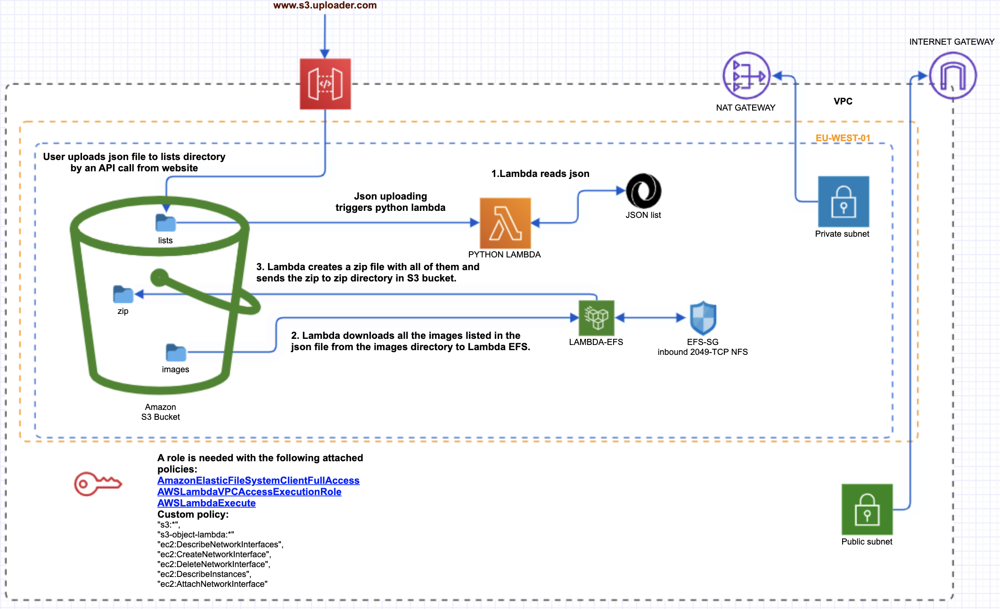
<br/><br/>

Security Groups,Public and private subnets, IAM policies, VPC and so on, are already provided by this repo.

Al the infrastructure is deployed in ```eu-west-01``` by default.

## Workflow

A client uploads images from a website to the images folder in the S3 bucket.

When the client wants to download a bulk of images from the website, it  runs a rest API call like:

```
curl -X PUT -H 'Accept:application/json' -H 'Content-Type:application/octet-stream' --data-binary @files/testapi.json https://aws-api.execute-api.eu-west-1.amazonaws.com/v1/random-lambda-bucket-name/lists/testapi.json

```

The above command will send the ```testapi.json``` json file (list of images) to the ```lists```  folder in the S3 bucket.

Json file can be named as per your preference but it has to have the same format that the current [testapi.json](https://github.com/seavba/get-files-from-S3/blob/main/iac-aws/files/testapi.json) json file located in the repo already as example.

Once the S3 bucket receives the json file, it triggers the lambda function.

The Lambda function, downloads all the images requested by the ```json file``` and add them in a ```zip file```. Once all the images have been added to the ```zip file```, lambda function uploads the ```zip file``` to ```zip folder``` in the same S3 bucket and generatess a secure URL which expires in 120 seconds.


## Getting Started

#### Pre-requisites

Terraform version used: Terraform v0.15.3<br>
Python runtime: Python 3.7

#### Deployment

Clone repo on your laptop:

```
cd /your/repo/path
git clone  git@github.com:seavba/get-files-from-S3.git
cd get-files-from-S3-api/iac-aws && terraform init && echo yes | terraform apply
```

### Variables
All the variables to be customised (if needed) can be found in [variables.tf](https://github.com/seavba/get-files-from-S3/blob/main/iac-aws/variables.tf) file.

#### Important variables to be defined:
- <b>access_key</b> and <b>secret_key</b> must be defined in [main.tf](https://github.com/seavba/get-files-from-S3/blob/main/iac-aws/main.tf#L18-L19) if you don't have aws cli credentials already configured.


#### Output Variables

After deployment, as output variable is shown a valid rest API PUT call for uploading a json file:

```
Apply complete! Resources: 46 added, 0 changed, 0 destroyed.

Outputs:

api_url = "curl -X PUT -H 'Accept:application/json' -H 'Content-Type:application/octet-stream' --data-binary @files/testapi.json https://rt8s8h4hil.execute-api.eu-west-1.amazonaws.com/v1/random-lambda-bucket-name/lists/testapi.json"
```

### Destroy Infrastructure

```
Delete S3 bucket content
cd /your/repo/path/get-files-from-S3-api/iac-aws
echo yes|terraform destroy
```

## Roadmap

A really good improvement about the lambda function optimization would be to make the download of the images and the zip file writing process in streaming mode, this way, EFS could be removed (saving costs and extra compute work) and the API trigger could call to lambda directly (instead of S3), passing the images lists from API to lambda function as params.

This link show how to do that using nodejs:
- [CREATE ZIP USING AWS LAMBDA WITH FILES STREAMED FROM S3](https://www.antstack.io/blog/create-zip-using-lambda-with-files-streamed-from-s3/)

Another ideal change, would be to receive the S3 link after zip creation instead of checking Cloudwatch logs.

API must be securized adding authentication.

## Demo

Terraform deployment:

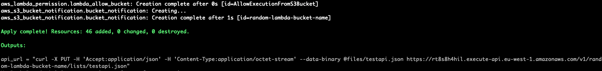
<br/><br/>

S3 bucket lists directory:

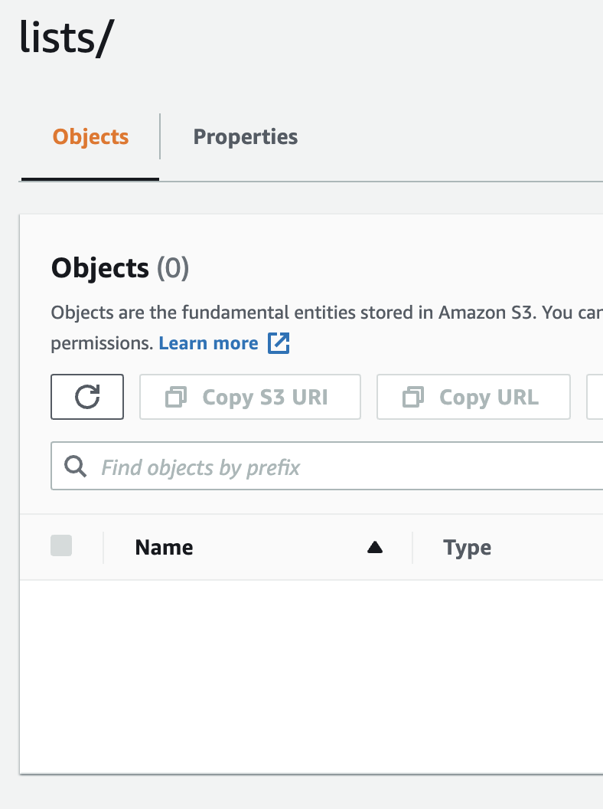
<br/><br/>

Lambda logs:

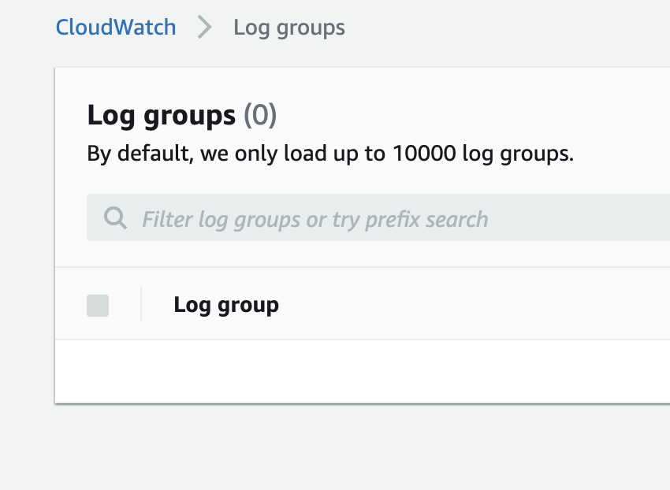
<br/><br/>

Rest API request:

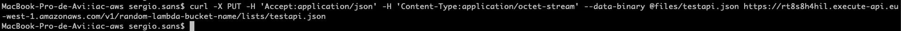
<br/><br/>

S3 bucket lists directory:

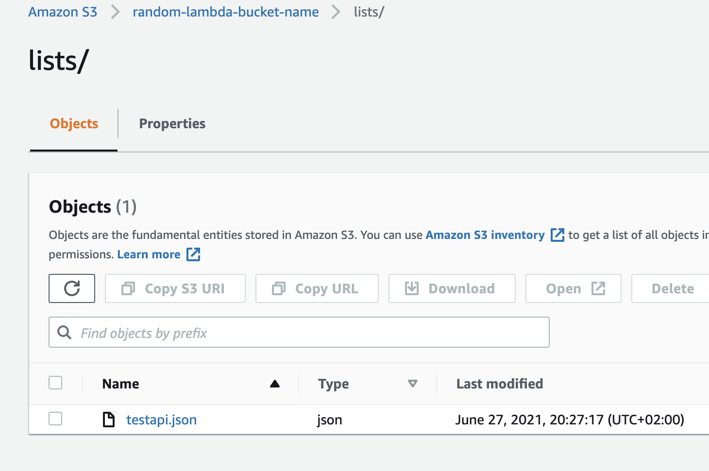
<br/><br/>

Lambda logs:

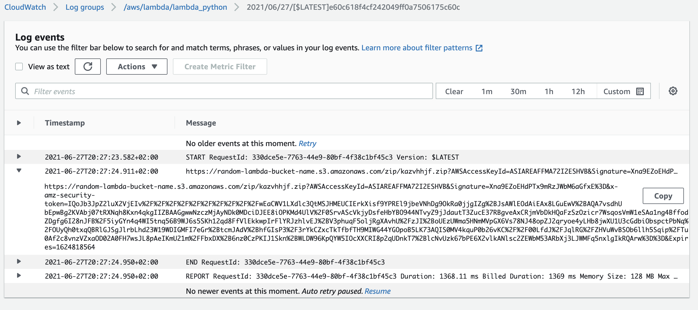
<br/><br/>

Copy link and test it in a browser (Expired sample):

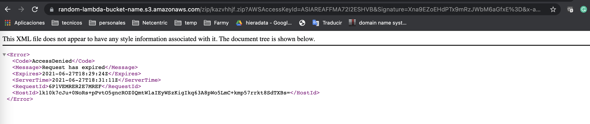
<br/><br/>

Repeat the api request, and check the logs aws_api_gateway_integration

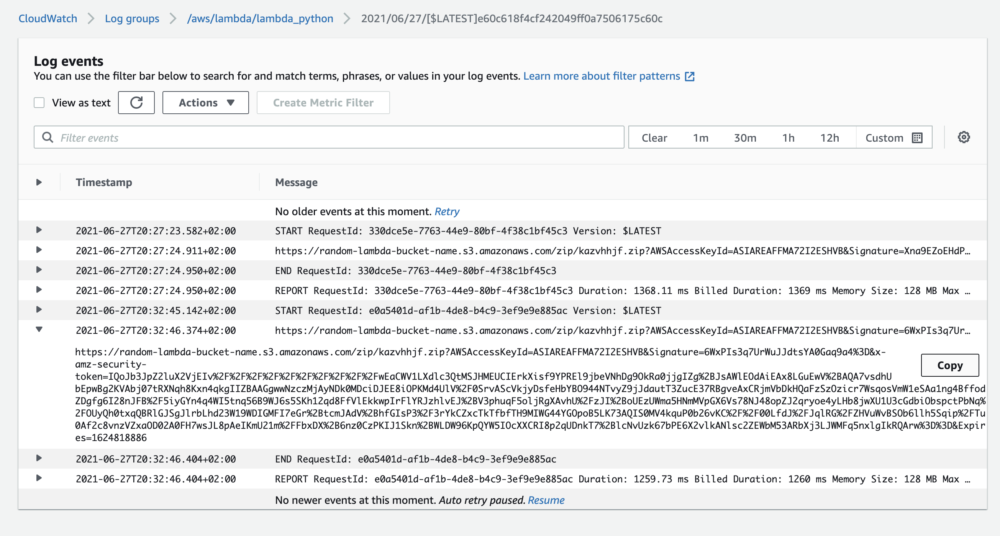
<br/><br/>

Download zip file:

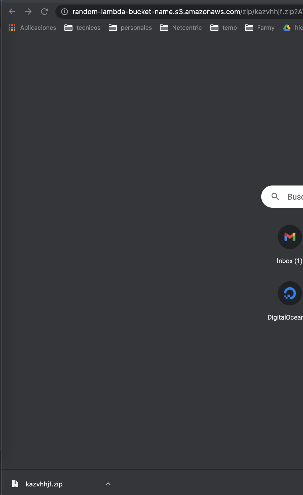
<br/><br/>

Check zip file in S3:

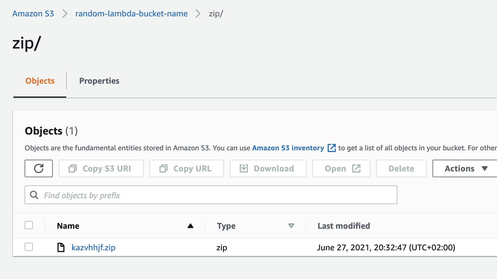
<br/><br/>

## Webgraphy

The following websites helped me to understand better how to implement the solution:

- [CREATE ZIP USING AWS LAMBDA WITH FILES STREAMED FROM S3](https://www.antstack.io/blog/create-zip-using-lambda-with-files-streamed-from-s3/)

- [Amazon documentation](https://aws.amazon.com/)

- [Terraform](https://registry.terraform.io/)

- [Boto3](https://boto3.amazonaws.com/v1/documentation/api/latest/index.html)
